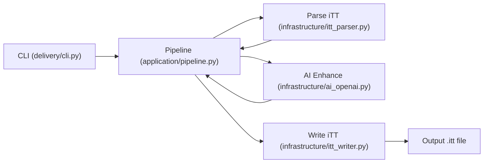

# Architecture Overview

## System Flow

## Components

### Delivery Layer
- `delivery/cli.py`
  - Parses CLI args (`--audio`, `--itt`, `--instructions`, `--out`, `--enable-ai`).
  - Loads instructions TOML.
  - Boots the pipeline.
  - Sets logging configuration.

### Application Layer
- `application/pipeline.py`
  - Orchestrates the workflow.
  - Parses `.itt` into segments.
  - Optionally calls AI to enhance text.
  - Writes output with the patcher to preserve formatting.
  - Copies the original file if unchanged.

### Domain Layer
- `domain/models.py`
  - Core data structures: `Segment`, `Instructions`, `OutputRules`, `Context`, `AIConfig`.

- `domain/rules.py`
  - Placeholder for formatting rules (line breaks, durations, etc.).

### Infrastructure Layer
- `infrastructure/itt_parser.py`
  - Parses iTT/TTML XML.
  - Extracts segments and preserves metadata.

- `infrastructure/itt_writer.py`
  - Patches the original file text.
  - Preserves formatting exactly (only changes `
` text and `begin/end`).

- `infrastructure/toml_config.py`
  - Reads TOML instructions.
  - Loads optional `details.md`.

- `infrastructure/ai_openai.py`
  - Calls OpenAI for transcript improvements.
  - Structured output schema + logging.
  - Unescapes HTML entities.
