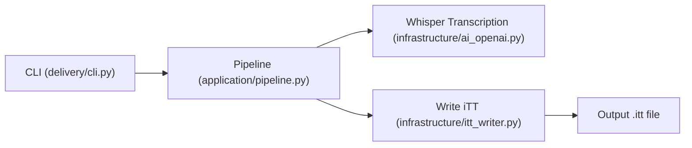

# Architecture Overview

## System Flow

```mermaid
flowchart LR
  A["CLI (delivery/cli.py)"] --> B["Pipeline (application/pipeline.py)"]
  B --> C["Whisper Transcription (infrastructure/ai_openai.py)"]
  B --> D["Write iTT (infrastructure/itt_writer.py)"]
  D --> E["Output .itt file"]
```

## Components

### Delivery Layer
- `delivery/cli.py`
  - Parses CLI args (`--audioin`, `--ittout`).
  - Applies defaults for missing arguments.
  - Boots the pipeline.
  - Sets logging configuration.

### Application Layer
- `application/pipeline.py`
  - Orchestrates the workflow.
  - Calls Whisper transcription.
  - Writes iTT output.

### Domain Layer
- `domain/models.py`
  - Core data structures: `Segment`.

### Infrastructure Layer
- `infrastructure/ai_openai.py`
  - Calls OpenAI Whisper for transcription.
  - Converts segments into `Segment` models.

- `infrastructure/itt_writer.py`
  - Writes iTT/TTML XML output from segments.
